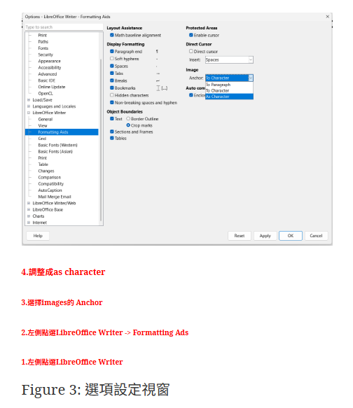
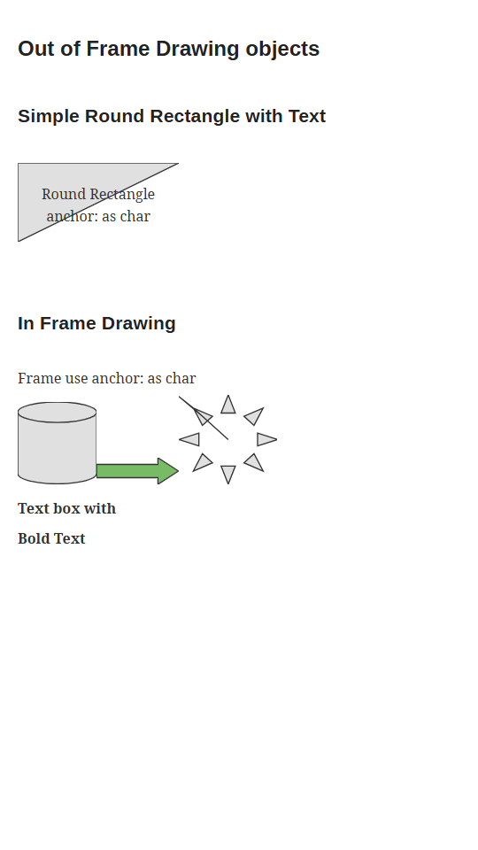

# Investigation

## v0.1 first version (by claude opus 4.5 thinking)

- Basic conversion work

### Issues

- Fonts differ from the those in original document
- Page split is not visible
- Image caption missing
- footnote not handle properly, show only the part at referencer with footnote number but not referenced footnote
- Drawing Object is not shown

Let me know if there is any difficulty in fixing these issues, 
e.g. recommended using exiting packages or library could help, or other limitation.

## v0.2  (by claude opus 4.5 thinking)

use of external resource is not preferred, the html should be offline viewable

## v0.3 (by google gemini 3 pro)

- `--page-breaks` should enable by default
- See a.odt, the figure number and caption is not shown properly
- See a.odt, drawing in frames doesn't work `figure 3: 選項設定視窗`
- strikethrough doesn't work at text `Obsidian WikiLink limitations motivated this approach`
- Tweak the tests accordingly for regression and reflects changes of features  

## v0.4 invegistation

### Issues

#### 1. Strikethrough goes over its expected boundary to italic text in a.odt

Explained in markdown (to mimic what i see in converted html)

Expect:

~~Strikethrough~~
_Iatlic_

Actual:

~~Strikethrough
_Iatlic_~~

#### 2. complex frame is not properly randered

#### 3. table boarder thickness is not respected

## v0.4.1

### Prompt

still cannot properly draw the odt drawing object with odt_to_html, i create script so you can convert odt, html -> png, this is for your debugging use. 
i also create sample_test_drawing.odt specifically for this situation, how about convert
for example you can do
# Use the developed odt -> html tool to convert odt to html
python .\odt_to_html.py .\sample_test_drawing.odt sample_test_drawing.html
# Generate Test images from odt,html -> png
python .\odf_to_png.py .\sample_test_drawing.odt sample_test_drawing.odt.png
python .\html_to_png.py .\sample_test_drawing.html sample_test_drawing.html.png

regarding the implementation, how about using the inline `<svg>` tag in html when converting `<draw:...>` tags in target.odt/content.xml

tell me your plan

## v0.4.2

odt, Drawing now showned, but the path seems not connected correctly, 

expect:

actual:

also the color of the drawaing is not correct.